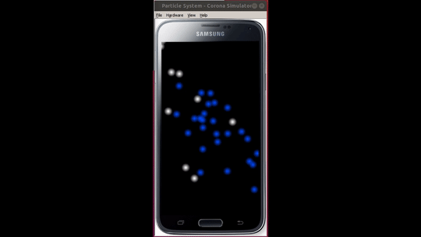

# Corona-Particle-System
Showcase application of Corona SDK built-in functions for particles system

This application shows how to create simple particle system using Corona SDK built-in Physics module.

Video below is showing what this showcase application is about

Documentation for functions used in this application can be found on official Corona site on link https://docs.coronalabs.com/api/type/ParticleSystem/index.html.
